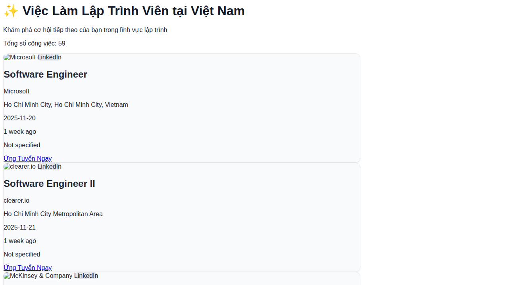

# SWE Jobs VN 🇻🇳

Chào mừng bạn đến với **SWE Jobs VN** - nơi tổng hợp các cơ hội việc làm hấp dẫn dành cho Lập trình viên (Software Engineer) tại thị trường Việt Nam!

**👉🏼 Truy cập ngay: [https://swejob.netlify.app/](https://swejob.netlify.app/)**

---

## 📌 Giới thiệu

**SWE Jobs VN** là một trang web miễn phí giúp bạn dễ dàng tìm kiếm các công việc lập trình viên tại Việt Nam. Trang web tổng hợp thông tin tuyển dụng từ nhiều nguồn uy tín, giúp bạn tiết kiệm thời gian và nhanh chóng tìm được công việc phù hợp.

### 🎯 Mục tiêu

- Cung cấp danh sách việc làm lập trình viên cập nhật liên tục
- Giúp người tìm việc dễ dàng so sánh các cơ hội từ nhiều công ty khác nhau
- Kết nối ứng viên với nhà tuyển dụng một cách nhanh chóng

---

## 👥 Dành cho ai?

Trang web này phù hợp với:

- **Sinh viên IT** đang tìm kiếm cơ hội thực tập hoặc công việc đầu tiên
- **Lập trình viên (Fresher/Junior)** muốn khởi đầu sự nghiệp
- **Lập trình viên có kinh nghiệm (Middle/Senior)** đang tìm kiếm cơ hội mới
- **Bất kỳ ai** quan tâm đến ngành công nghệ thông tin tại Việt Nam

---

## ✨ Lợi ích khi sử dụng

| Lợi ích | Mô tả |
|---------|-------|
| 🆓 **Miễn phí hoàn toàn** | Không cần đăng ký, không mất phí |
| ⚡ **Nhanh chóng** | Xem ngay danh sách việc làm mới nhất |
| 📱 **Dễ sử dụng** | Giao diện đơn giản, thân thiện trên mọi thiết bị |
| 🔗 **Liên kết trực tiếp** | Ứng tuyển ngay với một cú nhấp chuột |
| 🏢 **Đa dạng công ty** | Từ startup đến các tập đoàn lớn như Microsoft, Sony, Axon... |

---

## 📖 Hướng dẫn sử dụng

Sử dụng trang web rất đơn giản, chỉ cần làm theo các bước sau:

### Bước 1: Truy cập trang web
Mở trình duyệt và truy cập: **[https://swejob.netlify.app/](https://swejob.netlify.app/)**

### Bước 2: Xem danh sách việc làm
Trang web sẽ hiển thị danh sách các công việc lập trình viên hiện có. Mỗi công việc bao gồm:
- Tên vị trí tuyển dụng
- Tên công ty
- Địa điểm làm việc
- Ngày đăng tin
- Nguồn tuyển dụng (LinkedIn, v.v.)

### Bước 3: Tìm công việc phù hợp
Cuộn trang để xem tất cả các công việc. Bạn có thể tìm các vị trí như:
- Software Engineer
- Frontend Developer
- Backend Developer
- Fullstack Developer
- DevOps Engineer
- Và nhiều vị trí khác...

### Bước 4: Ứng tuyển
Khi tìm thấy công việc phù hợp, nhấn nút **"Ứng Tuyển Ngay"** để được chuyển đến trang tuyển dụng gốc và nộp hồ sơ.

---

## 🖼️ Minh họa giao diện

Dưới đây là hình ảnh giao diện thực tế của trang web:

### Trang danh sách việc làm

*Giao diện trang chủ hiển thị danh sách các công việc lập trình viên tại Việt Nam*

---

## 💬 Góp ý & Ý kiến người dùng

Chúng tôi luôn lắng nghe ý kiến đóng góp từ người dùng để cải thiện trang web tốt hơn!

### Cách gửi góp ý

Nếu bạn có ý kiến đóng góp, phát hiện lỗi, hoặc muốn đề xuất tính năng mới, vui lòng tạo một **GitHub Issue** theo các bước sau:

1. Truy cập trang Issues: **[Tạo Issue mới](https://github.com/cuongndc9/swe-job/issues/new)**
2. Điền tiêu đề ngắn gọn mô tả vấn đề hoặc đề xuất
3. Trong phần mô tả, hãy cung cấp thông tin chi tiết:
   - Nếu là **lỗi**: Mô tả lỗi bạn gặp phải, các bước để tái hiện lỗi
   - Nếu là **đề xuất**: Mô tả tính năng bạn muốn có và lý do
4. Nhấn **"Submit new issue"** để gửi

### Các loại góp ý được chào đón

- 🐛 Báo lỗi (Bug reports)
- 💡 Đề xuất tính năng mới (Feature requests)  
- 📝 Góp ý về giao diện người dùng (UI/UX feedback)
- 🔗 Đề xuất thêm nguồn việc làm mới
- ❓ Câu hỏi về cách sử dụng

---

## ℹ️ Lưu ý

- Đây là trang **landing page** dành cho người tìm việc, không phải nhà tuyển dụng
- Thông tin việc làm được tổng hợp từ các nguồn công khai
- Vui lòng kiểm tra kỹ thông tin trước khi ứng tuyển
- Trang web không chịu trách nhiệm về nội dung tuyển dụng từ bên thứ ba

---

## 📞 Liên hệ

Được tạo bởi ❤️ bởi [Nguyễn Duy Cương](https://www.linkedin.com/in/cuong9/)

---

**🚀 Chúc bạn sớm tìm được công việc mơ ước!**
